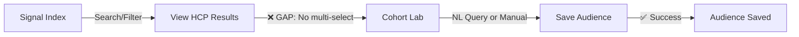
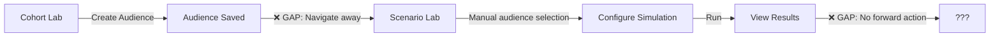
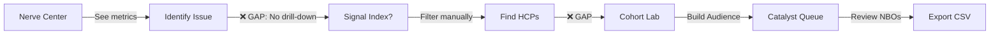
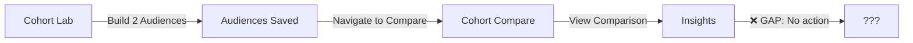
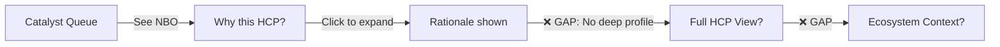
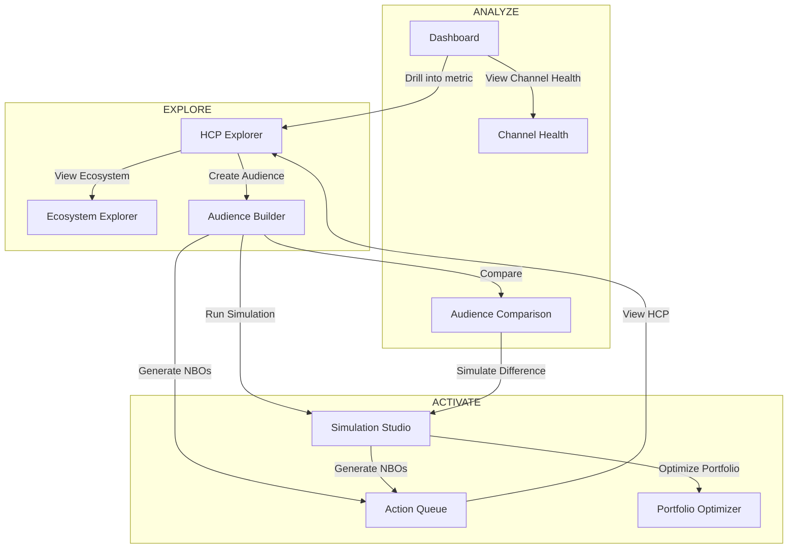

# PHASE 13.1: User Journey & Module Integration Audit

**Generated:** 2026-01-20  
**Purpose:** Map user journeys to expose integration gaps, inform module renaming, UX redesign, and navigation architecture  
**Scope:** All modules except Ecosystem Explorer (Phase 14)

---

## Executive Summary

OmniVor has 13 distinct routes/modules built across 12 phases. While individually feature-complete, the platform lacks **contextual handoffs** — users complete tasks in one module but face dead-ends or manual re-entry to continue their workflow. 

**Key Findings:**
- 7 critical integration gaps identified
- 9 modules need renaming for white-label compatibility
- 5 platform-level journeys mapped with friction points
- Primary pain: No "flow state" — users navigate via sidebar rather than task completion

---

## Part 1: Module Inventory

### Current Module Map

| Route | Current Name | Sidebar Section | Primary Function | White-Label Risk |
|-------|--------------|-----------------|------------------|------------------|
| `/` or `/hcp-explorer` | Signal Index | Intelligence | HCP search, filter, browse | ⚠️ "Signal" is brand jargon |
| `/audience-builder` | Cohort Lab | Intelligence | NL query, audience creation | ⚠️ "Lab" is brand pattern |
| `/simulations` | Scenario Lab | Activation | What-if simulations | ⚠️ "Lab" is brand pattern |
| `/action-queue` | Catalyst Queue | Activation | NBO review & export | ⚠️ "Catalyst" is brand jargon |
| `/dashboard` | Nerve Center | Analytics | Overview metrics | ⚠️ "Nerve Center" is brand jargon |
| `/cohort-compare` | Cohort Compare | Activation | Side-by-side audience comparison | ✅ Descriptive |
| `/ecosystem` | Ecosystem Explorer | Intelligence | L1/L2/L3 visualization | ✅ Keep as-is (Phase 14) |
| `/agents` | Agent Orchestrator | System | Agentic workflow management | ⚠️ Internal-facing |
| `/constraints` | Constraint Surface | System | Budget/timing constraints | ⚠️ Technical jargon |
| `/allocation-lab` | Allocation Lab | System | Portfolio optimization | ⚠️ "Lab" is brand pattern |
| `/feature-store` | Signal Diagnostic | System | Channel health analysis | ⚠️ "Signal" is brand jargon |
| `/model-evaluation` | Model Evaluation | System | ML model accuracy tracking | ✅ Descriptive |
| `/settings` | Settings | — | App configuration | ✅ Standard |

### Module Capability Matrix

| Module | Creates Data | Consumes Data | Exports Data | Has Forward CTA |
|--------|--------------|---------------|--------------|-----------------|
| Signal Index | ❌ | HCPs | ❌ | ❌ Missing |
| Cohort Lab | ✅ Audiences | HCPs, Audiences | CSV | ⚠️ Partial |
| Scenario Lab | ✅ Simulations | Audiences | CSV | ⚠️ Partial |
| Catalyst Queue | ❌ | NBOs, HCPs | CSV | ❌ Terminal |
| Nerve Center | ❌ | Aggregates | ❌ | ❌ Missing |
| Cohort Compare | ❌ | Audiences | ❌ | ❌ Terminal |
| Ecosystem Explorer | ❌ | HCPs, Channels | ❌ | ❌ (Phase 14) |

---

## Part 2: Platform-Level User Journeys

### Journey 1: "Find Target HCPs and Build a Reachable Audience"

**Persona:** Brand Marketer  
**Goal:** Identify high-value HCPs and create a targetable segment  
**Frequency:** Weekly



**Current Flow:**
1. User opens Signal Index
2. Applies filters (specialty, tier, location)
3. Reviews HCP cards
4. **FRICTION:** Cannot select multiple HCPs to create audience
5. Must navigate to Cohort Lab separately
6. Must re-enter criteria or use NL query
7. Creates and saves audience

**Ideal Flow:**
1. User opens HCP Explorer (renamed)
2. Applies filters, views results
3. Multi-selects HCPs with checkboxes
4. Clicks "Create Audience from Selection" (new CTA)
5. Drawer opens with naming form
6. Saves audience, offered "Run Simulation" or "Generate Recommendations"

**Gap Type:** Missing CTA, no multi-select, no contextual handoff

---

### Journey 2: "Simulate Campaign Impact on Target Audience"

**Persona:** Brand Strategist  
**Goal:** Test messaging/channel strategies before execution  
**Frequency:** Bi-weekly



**Current Flow:**
1. User creates audience in Cohort Lab
2. Saves audience
3. **FRICTION:** No "Run Simulation" CTA — must navigate via sidebar
4. Opens Scenario Lab
5. Must select saved audience from dropdown (context lost)
6. Configures simulation parameters
7. Runs simulation, views results
8. **FRICTION:** No path to action — results are terminal

**Ideal Flow:**
1. User creates audience in Audience Builder (renamed)
2. Saves audience
3. Toast appears: "Audience saved. Run Simulation?"
4. Clicks CTA, Simulation Studio (renamed) opens with audience pre-selected
5. Configures and runs simulation
6. Results show "Generate Recommendations" CTA
7. Clicks, flows to Action Queue with recommendations

**Gap Type:** Missing forward CTAs at both entry and exit

---

### Journey 3: "Generate and Export Next Best Actions"

**Persona:** Field Sales Lead  
**Goal:** Get actionable HCP recommendations for field team  
**Frequency:** Weekly



**Current Flow:**
1. User checks Nerve Center (Dashboard)
2. Sees metric indicating issue (e.g., "Email fatigue rising")
3. **FRICTION:** No drill-down — must manually navigate
4. Goes to Signal Index, applies relevant filters
5. **FRICTION:** No audience creation from results
6. Goes to Cohort Lab, builds audience
7. **FRICTION:** No direct path to NBO generation
8. Goes to Catalyst Queue
9. Reviews and exports recommendations

**Ideal Flow:**
1. User checks Dashboard (renamed)
2. Clicks metric card → Drills into relevant HCP list
3. Multi-selects HCPs, clicks "Create Audience"
4. Audience Builder opens with selection, saves
5. Clicks "Generate Recommendations"
6. Action Queue (renamed) shows NBOs
7. Reviews, approves, exports

**Gap Type:** Dashboard widgets not clickable, no metric-to-action path

---

### Journey 4: "Compare Audience Performance"

**Persona:** Analytics Lead  
**Goal:** Understand what differentiates high-performers from low-performers  
**Frequency:** Monthly



**Current Flow:**
1. User builds two audiences (high performers, low performers)
2. Saves both audiences
3. Navigates to Cohort Compare via sidebar
4. Selects both audiences
5. Views comparison metrics
6. **FRICTION:** No forward action — insights are terminal

**Ideal Flow:**
1. User builds audiences in Audience Builder
2. On audience list, sees "Compare" multi-select action
3. Selects two audiences, clicks "Compare"
4. Comparison view shows insights
5. Highlights actionable differences: "High performers have 2x webinar attendance"
6. CTA: "Simulate webinar campaign for low performers"

**Gap Type:** Terminal view, no insight-to-action bridge

---

### Journey 5: "Understand Why an HCP is Flagged"

**Persona:** Medical Science Liaison (MSL)  
**Goal:** Understand the "why" behind a recommendation before outreach  
**Frequency:** Daily (during field prep)



**Current Flow:**
1. User opens Catalyst Queue
2. Sees recommended action for HCP
3. Expands row, sees rationale
4. **FRICTION:** Wants full HCP profile — no link
5. Must open Signal Index in new tab
6. Must search for HCP manually
7. **FRICTION:** No Ecosystem view from profile

**Ideal Flow:**
1. User opens Action Queue (renamed)
2. Sees recommended action, clicks HCP name
3. Side drawer opens with full HCP profile
4. Profile includes mini-ecosystem view (channels, recent touches)
5. CTA: "View Full Ecosystem" (opens Ecosystem Explorer focused on HCP)

**Gap Type:** Missing profile drawer, no cross-module linking

---

## Part 3: Module-Level Journeys

### Signal Index (HCP Explorer)

| Journey | Steps | Friction |
|---------|-------|----------|
| Find specific HCP | Search → View card → Expand detail | ✅ Works |
| Find HCPs by criteria | Filter → Browse results → ??? | ❌ No forward action |
| Export HCP list | Filter → ??? | ❌ No export from this view |

**Required Additions:**
- [ ] Multi-select checkboxes on HCP cards
- [ ] "Create Audience from Selection" CTA (appears when ≥1 selected)
- [ ] "Export Selection" CTA
- [ ] "View in Ecosystem" link on individual HCP cards

---

### Cohort Lab (Audience Builder)

| Journey | Steps | Friction |
|---------|-------|----------|
| Build audience with NL | Type query → Review results → Save | ⚠️ No post-save CTA |
| Manage saved audiences | View list → Edit/Delete | ✅ Works |
| Use audience elsewhere | Save → Navigate away → Select in target | ❌ Context lost |

**Required Additions:**
- [ ] Post-save action menu: "Run Simulation", "Generate NBOs", "View in Compare"
- [ ] "Import from HCP Explorer" that accepts selection context
- [ ] Audience cards with quick-action buttons

---

### Scenario Lab (Simulation Studio)

| Journey | Steps | Friction |
|---------|-------|----------|
| Run simulation | Select audience → Configure → Run → View results | ⚠️ Results terminal |
| Compare scenarios | Run multiple → View history → ??? | ❌ No comparison view |
| Act on results | View results → ??? | ❌ No "Generate NBOs" CTA |

**Required Additions:**
- [ ] Pre-populate audience from navigation context
- [ ] "Generate Recommendations" CTA on results
- [ ] Scenario comparison view (future: Phase 14+)

---

### Catalyst Queue (Action Queue)

| Journey | Steps | Friction |
|---------|-------|----------|
| Review recommendations | Load → Review → Approve/Reject | ✅ Works |
| Export for execution | Select approved → Export CSV | ✅ Works |
| Understand recommendation | Click expand → View rationale | ⚠️ No HCP deep-dive |

**Required Additions:**
- [ ] HCP name links to profile drawer
- [ ] "Refresh Recommendations" for updated audience
- [ ] Bulk actions (approve all high-confidence)

---

### Nerve Center (Dashboard)

| Journey | Steps | Friction |
|---------|-------|----------|
| Check health | View metrics | ✅ Works |
| Investigate issue | See problem metric → ??? | ❌ No drill-down |
| Take action | ??? | ❌ No path to action modules |

**Required Additions:**
- [ ] Metric cards clickable → Navigate to filtered view
- [ ] "Quick Actions" section with top recommendations
- [ ] Alert/notification for critical issues

---

## Part 4: Integration Gap Matrix

| # | From Module | To Module | Current Path | Ideal Path | Gap Type | Priority |
|---|-------------|-----------|--------------|------------|----------|----------|
| 1 | Signal Index | Cohort Lab | Sidebar nav, manual re-entry | "Create Audience" CTA with selection | Missing CTA | P0 |
| 2 | Cohort Lab | Scenario Lab | Sidebar nav, select from dropdown | "Run Simulation" post-save CTA | Missing handoff | P0 |
| 3 | Scenario Lab | Catalyst Queue | No path | "Generate Recommendations" on results | Missing CTA | P0 |
| 4 | Nerve Center | Signal Index | No path | Clickable metrics → filtered view | Missing drill-down | P1 |
| 5 | Catalyst Queue | Signal Index | No path | HCP name → profile drawer | Missing link | P1 |
| 6 | Cohort Lab | Cohort Compare | Sidebar nav | "Compare" multi-select action | Missing CTA | P2 |
| 7 | Any Profile | Ecosystem Explorer | No path | "View Ecosystem" link | Missing link | P2 |

---

## Part 5: Module Rename Recommendations

### Guiding Principles

1. **Self-descriptive over branded** — Users should understand function without onboarding
2. **White-label compatible** — No OmniVor-specific terminology in module names
3. **Industry-aligned** — Use terms pharma professionals recognize
4. **Consistent patterns** — Similar functions use similar naming structures

### Recommended Renames

| Current Name | Proposed Name | Route (unchanged) | Rationale |
|--------------|---------------|-------------------|-----------|
| Signal Index | **HCP Explorer** | `/hcp-explorer` | "Signal" is brand jargon; "Explorer" is industry standard |
| Cohort Lab | **Audience Builder** | `/audience-builder` | "Lab" pattern not self-descriptive; "Builder" implies creation |
| Scenario Lab | **Simulation Studio** | `/simulations` | "Studio" implies workspace; avoids "Lab" repetition |
| Catalyst Queue | **Action Queue** | `/action-queue` | "Catalyst" is brand jargon; "Action" is self-explanatory |
| Nerve Center | **Dashboard** | `/dashboard` | Universal SaaS terminology; immediately understood |
| Cohort Compare | **Audience Comparison** | `/cohort-compare` | Parallel with "Audience Builder" naming |
| Agent Orchestrator | **Agent Manager** | `/agents` | "Orchestrator" is technical jargon |
| Constraint Surface | **Constraints** | `/constraints` | Simplified; "Surface" adds nothing for users |
| Allocation Lab | **Portfolio Optimizer** | `/allocation-lab` | Describes function; removes "Lab" |
| Signal Diagnostic | **Channel Health** | `/feature-store` | "Signal" brand jargon; "Channel Health" is the feature |
| Model Evaluation | *Keep as-is* | `/model-evaluation` | Already descriptive; internal-facing |

### Sidebar Reorganization

**Proposed Structure:**

```
EXPLORE
├── HCP Explorer (was Signal Index)
├── Ecosystem Explorer (unchanged)
└── Audience Builder (was Cohort Lab)

ANALYZE
├── Dashboard (was Nerve Center)
├── Audience Comparison (was Cohort Compare)
└── Channel Health (was Signal Diagnostic)

ACTIVATE
├── Simulation Studio (was Scenario Lab)
├── Action Queue (was Catalyst Queue)
└── Portfolio Optimizer (was Allocation Lab)

SYSTEM
├── Agent Manager (was Agent Orchestrator)
├── Constraints (was Constraint Surface)
├── Model Evaluation (unchanged)
└── Settings
```

**Rationale for groupings:**
- **Explore**: Finding and organizing HCPs
- **Analyze**: Understanding what's happening
- **Activate**: Taking action on insights
- **System**: Configuration and advanced features

---

## Part 6: UX Pass Recommendations

### Global Patterns to Implement

#### 1. Contextual Action Bar
When user has selection/context, show sticky action bar:
```
┌─────────────────────────────────────────────────────────────┐
│ 12 HCPs selected   [Create Audience] [Export] [Clear]       │
└─────────────────────────────────────────────────────────────┘
```

#### 2. Post-Save Action Menu
After saving any object (audience, simulation), offer next steps:
```
┌─────────────────────────────────────────────────────────────┐
│ ✓ Audience "Q1 Targets" saved                               │
│                                                             │
│ What's next?                                                │
│ [Run Simulation]  [Generate Recommendations]  [Compare]     │
└─────────────────────────────────────────────────────────────┘
```

#### 3. Profile Drawer Pattern
Click any HCP name anywhere → Slide-in drawer with:
- Key stats (tier, specialty, engagement score)
- Channel health mini-radial
- Recent touches timeline
- CTAs: "View Full Profile", "View Ecosystem", "Add to Audience"

#### 4. Breadcrumb Context
Show navigation path and allow quick jumps:
```
Dashboard > Email Fatigue > HCP Explorer (filtered) > Dr. Smith
```

#### 5. Metric Drill-Down
Every dashboard metric should be clickable:
- Navigates to relevant module
- Pre-applies relevant filters
- Shows "Viewing: HCPs with declining email engagement"

### Module-Specific UX Priorities

| Module | Top 3 UX Priorities |
|--------|---------------------|
| HCP Explorer | 1. Multi-select with action bar 2. Card hover → quick actions 3. Export from view |
| Audience Builder | 1. Post-save action menu 2. Visual audience preview 3. Edit mode improvements |
| Simulation Studio | 1. Audience context persistence 2. Results → Action CTA 3. Parameter templates |
| Action Queue | 1. HCP name → drawer 2. Bulk approve/reject 3. Confidence threshold filter |
| Dashboard | 1. Clickable metrics 2. Quick actions section 3. Alert badges |
| Audience Comparison | 1. Entry from Audience Builder 2. Difference highlighting 3. Action recommendations |

---

## Part 7: Implementation Priority Matrix

### Phase 13.0: Foundation (Week 1)
| Task | Effort | Impact |
|------|--------|--------|
| Global find/replace for module renames | 2h | High |
| Update sidebar labels and groupings | 2h | High |
| Update page headers and titles | 1h | Medium |
| Update command palette items | 1h | Medium |
| Update onboarding tooltips | 1h | Medium |

### Phase 13.1: Critical Path Integration (Week 2-3)
| Task | Effort | Impact |
|------|--------|--------|
| HCP Explorer multi-select + action bar | 4h | Critical |
| "Create Audience from Selection" flow | 3h | Critical |
| Audience Builder post-save action menu | 3h | Critical |
| Simulation Studio context persistence | 2h | High |
| Simulation results → Action Queue CTA | 2h | High |

### Phase 13.2: Secondary Integrations (Week 3-4)
| Task | Effort | Impact |
|------|--------|--------|
| Dashboard metric drill-down | 4h | High |
| HCP profile drawer (reusable component) | 4h | High |
| Action Queue → HCP drawer integration | 2h | Medium |
| Audience Comparison entry improvement | 2h | Medium |

### Phase 13.3: Polish (Week 4-5)
| Task | Effort | Impact |
|------|--------|--------|
| Breadcrumb context system | 3h | Medium |
| Bulk actions in Action Queue | 2h | Medium |
| Export from HCP Explorer | 2h | Medium |
| Empty states with forward actions | 2h | Low |

---

## Appendix A: Mermaid Diagram — Full Platform Flow (Ideal State)



---

## Appendix B: Nomenclature Migration Checklist

Files requiring updates for rename:

### Navigation & Routing
- [ ] `client/src/components/app-sidebar.tsx` — Sidebar labels
- [ ] `client/src/components/ui/command-palette.tsx` — Command items
- [ ] `client/src/components/onboarding/feature-tooltip.tsx` — Tooltip content
- [ ] `client/src/components/onboarding/first-run-guide.tsx` — Guide steps

### Page Headers
- [ ] `client/src/pages/hcp-explorer.tsx` — "Signal Index" → "HCP Explorer"
- [ ] `client/src/pages/audience-builder.tsx` — "Cohort Lab" → "Audience Builder"
- [ ] `client/src/pages/simulations.tsx` — "Scenario Lab" → "Simulation Studio"
- [ ] `client/src/pages/action-queue.tsx` — "Catalyst Queue" → "Action Queue"
- [ ] `client/src/pages/dashboard.tsx` — "Nerve Center" → "Dashboard"
- [ ] `client/src/pages/cohort-compare.tsx` — "Cohort Compare" → "Audience Comparison"
- [ ] `client/src/pages/agents.tsx` — "Agent Orchestrator" → "Agent Manager"
- [ ] `client/src/pages/constraints.tsx` — "Constraint Surface" → "Constraints"
- [ ] `client/src/pages/allocation-lab.tsx` — "Allocation Lab" → "Portfolio Optimizer"
- [ ] `client/src/pages/feature-store.tsx` — "Signal Diagnostic" → "Channel Health"

### Documentation
- [ ] `OMNIVOR-LABS-STYLE-GUIDE.md` — Feature naming table
- [ ] `STATUS.md` — References throughout
- [ ] `ROADMAP.md` — References throughout
- [ ] `CHANGELOG.md` — Historical references (leave as-is for history)

---

*End of Phase 13.1 User Journey & Module Integration Audit*
